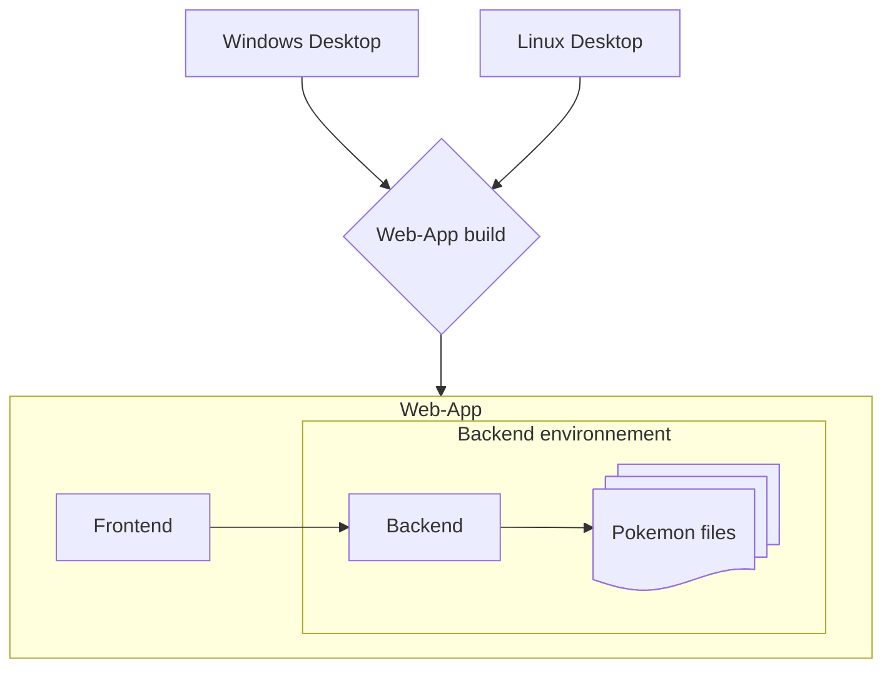

# PKVault - Technical

PKVault project is composed as so:

- a backend in C# .NET10
- a frontend in Typescript/React
- a desktop app in C# Photino

The core is the web app (backend & frontend).
Desktop app is just consuming the web app as a container using Photino for web rendering.

Check each package README for more technical documentation.

## Quick start

You can target dev & build for desktop Windows app or web app.

> Editor note: all code & its documentation were made with/for VS Code. Any other editor may still work, without warranty.

### 1 - General preparation

- Clone this repository including submodules (pokeapi)
- Run the setup part in [PKVault.Backend](../../PKVault.Backend/README.md#setup)
- Same with setup part in [frontend](../../frontend/README.md#setup)

### 2a - Web app (backend + frontend)

- Run the dev part in [PKVault.Backend](../../PKVault.Backend/README.md#dev)
- Same with dev part in [frontend](../../frontend/README.md#dev)

### 2b - Desktop app

- From project root, run `make prepare-desktop` (needs tool `make`)
- Run the setup & dev parts in [PKVault.Desktop](../../PKVault.Desktop/README.md)
